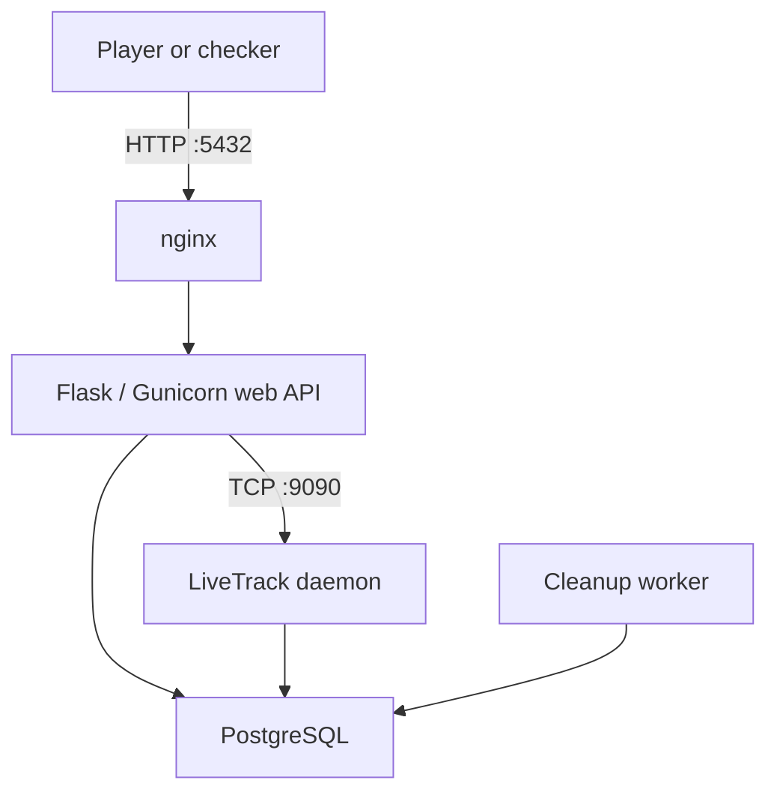

# OverEats — ENOWARS Attack/Defense Service Documentation

OverEats is a food-delivery service created for ENOWARS 10. It combines a
Flask HTTP API, a Go binary-protocol daemon called LiveTrack, PostgreSQL, and
nginx. The competition version is intentionally vulnerable and contains three
independent flagstores and three intended exploit paths.

This document describes the version used for the CTF, how its checker stores
and retrieves flags, how the reference exploits work, and how each
vulnerability should be fixed before the service is reused outside an
attack/defense setting.


## 1. Quick start

Run these commands from the directory containing the service's
`docker-compose.yml`:

```bash
docker compose up -d --build
docker compose ps
curl http://127.0.0.1:5432/api/health
```

The health endpoint should return a response equivalent to:

```json
{"service":"OverEats","status":"healthy"}
```

Useful maintenance commands:

```bash
# Follow all service logs
docker compose logs -f

# Follow one component
docker compose logs -f nginx
docker compose logs -f web
docker compose logs -f livetrack
docker compose logs -f postgres
docker compose logs -f cleanup

# Rebuild and recreate the service after source changes
docker compose up -d --build --force-recreate

# Stop the service without deleting its data
docker compose down
```

To start with an empty database and a new encryption-key volume:

```bash
# Destructive: deletes all OverEats database and key volumes.
docker compose down -v
docker compose up -d --build
```

The host port `5432` belongs to nginx and carries HTTP traffic. PostgreSQL also
uses port `5432` inside the Docker network, but it is not published to players.

## 2. Architecture



| Component | Purpose | Player access |
| --- | --- | --- |
| nginx | Publishes the service and proxies HTTP requests to the web container | Host TCP `5432` |
| Flask/Gunicorn web API | Users, restaurants, menus, orders, deliveries, notes, and the HTTP-to-LiveTrack gateway | Through nginx only |
| LiveTrack | Go daemon implementing GPS, delivery status, and chat through a custom framed TCP protocol | Internal TCP `9090`, reached by players through the web gateway |
| PostgreSQL | Stores all application and flag data | Docker network only |
| Cleanup worker | Periodically calls the database cleanup function | No player access |

The web and LiveTrack containers share the PostgreSQL database. The web API is
therefore both the main HTTP application and a gateway to the separate
LiveTrack attack surface.

## 3. Normal service operation

### 3.1 User roles

OverEats has three roles:

- `customer`: browses restaurants, places orders, writes private order notes,
  and chats with the assigned driver.
- `restaurant`: creates a restaurant and menu, receives orders, changes order
  state, and assigns a driver.
- `driver`: views assigned deliveries, updates GPS coordinates and delivery
  state, and chats with the customer.

Registration and login use the HTTP API. A successful request returns a
session token. Authenticated HTTP endpoints expect:

```http
Authorization: Bearer <token>
```

Sessions normally expire after one hour. LiveTrack authentication is separate:
the client sends the same username and password to opcode `0x01` on a
LiveTrack connection.

### 3.2 Typical delivery workflow

1. A restaurant user registers and creates a restaurant.
2. The restaurant adds at least one menu item.
3. A customer registers, browses the menu, and places an order.
4. The order may contain `special_instructions`.
5. A driver registers.
6. The restaurant assigns the driver, creating a delivery.
7. The customer and driver exchange LiveTrack chat messages.
8. The driver can send GPS updates and change the delivery state.
9. The customer can store encrypted private notes for the order.

### 3.3 Main database entities

| Table | Important relationship or content |
| --- | --- |
| `users` | Login identity and role |
| `sessions` | Bearer tokens and expiration timestamps |
| `restaurants` | Owned by a restaurant-role user |
| `menu_items` | Belong to a restaurant |
| `orders` | Connect a customer to a restaurant; contains items and special instructions |
| `deliveries` | Connect an order to a driver |
| `chat_messages` | Messages belonging to a delivery |
| `order_notes` | AES-CBC-encrypted customer notes and their HMAC |

Foreign keys from deliveries and notes to orders, and from chat messages to
deliveries, should use cascading deletion so cleanup can remove complete old
delivery trees without leaving orphaned rows.

## 4. LiveTrack protocol

LiveTrack uses length-prefixed binary frames.

### Request frame

| Offset | Size | Field |
| --- | --- | --- |
| `0` | 1 byte | Opcode |
| `1` | 2 bytes | Unsigned big-endian payload length |
| `3` | Declared length | Payload |

### Response frame

| Offset | Size | Field |
| --- | --- | --- |
| `0` | 1 byte | Status |
| `1` | 2 bytes | Unsigned big-endian response length |
| `3` | Declared length | Response data |

Response statuses are:

| Status | Meaning |
| --- | --- |
| `0x00` | OK |
| `0x01` | Error |
| `0x02` | Authentication required |

Relevant request opcodes are:

| Opcode | Name | Payload |
| --- | --- | --- |
| `0x01` | `AUTH` | `username:password` |
| `0x02` | `GPS_UPDATE` | `delivery_id:latitude,longitude` |
| `0x03` | `STATUS_CHANGE` | `delivery_id:status` |
| `0x04` | `CHAT_SEND` | `delivery_id:message` |
| `0x05` | `CHAT_HISTORY` | `delivery_id` |
| `0x06` | `BATCH` | Concatenated request subframes |
| `0x10` | `PING` | Empty |
| `0x30` | `DEBUG_ATTACH` | `delivery_id` |
| `0x31` | `SET_DEBUG` | Empty |

The normal HTTP gateway is `POST /api/livetrack/action`. The lower-level
`POST /api/livetrack/raw` endpoint accepts hex-encoded frames, forwards all
frames in one request over the same TCP connection, and returns hex-encoded
response frames. The checker uses this raw gateway for chat operations, and the
competition exploit uses it to reach the debug and batch opcodes.

## 5. Flagstores and checker behavior

The checker uses zero-based flagstore IDs. Keep this mapping unchanged when
moving the service to another A/D CTF unless the checker is updated at the same
time.

| Flagstore | Flag location | Normal retrieval | `attack_info` |
| --- | --- | --- | --- |
| `0` | `orders.special_instructions` | Customer reads their order details | `order_id` |
| `1` | `chat_messages.message` | Customer reads the delivery's LiveTrack history | `delivery_id` |
| `2` | Encrypted plaintext represented by `order_notes.encrypted_data` | Customer reads and decrypts notes for their order | `order_id` |

### 5.1 Flagstore 0: order special instructions (exploited by 44% of teams)

`putflag(0)`:

1. Registers a restaurant and a customer.
2. Creates a restaurant and menu item.
3. Places an order with the flag in `special_instructions`.
4. Stores the customer credentials and order ID in the checker's chain DB.
5. Returns the order ID as attack information.

`getflag(0)` logs in as the original customer and requests
`GET /api/orders/<order_id>/details`.

### 5.2 Flagstore 1: LiveTrack chat (exploited by 41% of teams)

`putflag(1)`:

1. Registers a restaurant, customer, and driver.
2. Creates a restaurant, item, order, and delivery.
3. Authenticates the customer to LiveTrack.
4. Sends the flag as a `CHAT_SEND` message.
5. Stores the credentials and delivery ID in the chain DB.
6. Returns the delivery ID as attack information.

`getflag(1)` logs in as the original customer, authenticates to LiveTrack, and
uses `CHAT_HISTORY` for the stored delivery.

### 5.3 Flagstore 2: encrypted order note (exploited by 42% of teams)

`putflag(2)`:

1. Registers a restaurant and customer.
2. Creates a restaurant, item, and order.
3. Posts the flag as a private note to
   `POST /api/orders/<order_id>/notes`.
4. Stores the customer credentials, customer ID, and order ID in the chain DB.
5. Returns the order ID as attack information.

`getflag(2)` logs in as the original customer and requests
`GET /api/orders/<order_id>/notes`. The application verifies and decrypts the
stored blob before returning the plaintext note.

The checker additionally contains two noise variants and six havoc functions.
They cover order data, LiveTrack chat, health, public listings, LiveTrack ping,
registration/login, authorization failures, duplicate users, and malformed or
boundary input. Its three `exploit` handlers contain the reference exploits
described below.

## 6. Vulnerability 0 — internal-header authentication bypass

### Affected flagstore

Flagstore `0`: `orders.special_instructions`.

### Root cause

The application contains an internal-service shortcut:

```python
def check_internal_auth():
    internal_auth = request.headers.get("X-Internal-Auth", "")
    return internal_auth == INTERNAL_SECRET
```

When this check succeeds, `/api/orders/<id>/details` returns an order without
checking whether the caller owns it. The competition nginx configuration strips
the hyphenated `X-Internal-Auth` header, but does not safely handle the
underscore spelling `X_Internal_Auth`. nginx and the WSGI stack disagree about
the two spellings; the backend sees the underscore variant as the trusted
header.

The competition secret is also present in the service configuration. In an A/D
CTF, source and deployment files are available to the teams, so secrecy of this
value cannot be the security boundary.

### Reference exploit

1. Obtain an order ID from the supplied `attack_info` or enumerate the public
   `GET /api/orders/recent` response.
2. Request the order details with the underscore header and the known internal
   value.
3. Read `order.special_instructions` from the JSON response.

Equivalent requests are:

```bash
curl http://TARGET:5432/api/orders/recent

curl \
  -H 'X_Internal_Auth: SuperSecretInternalKey2026' \
  http://TARGET:5432/api/orders/ORDER_ID/details
```

No victim credentials are needed. With `attack_info`, one request is enough;
without it, the exploit scans recent order IDs.

### Fix

The robust fix is to remove the public endpoint's internal-header shortcut and
always perform object-level authorization. Apply this to both order details and
delivery creation: a customer may read their own order, the restaurant owner
may read and manage its orders, and a driver may access only an assigned
delivery.

If an internal service path is genuinely required, expose it on a separate
internal listener or location and authenticate it independently, for example
with mTLS or a short-lived service identity. Do not treat a client-controlled
header on the public route as proof of internal origin.

As defense in depth, nginx should reject underscore headers and clear every
accepted spelling before proxying public traffic:

```nginx
underscores_in_headers off;
ignore_invalid_headers on;

proxy_set_header X-Internal-Auth "";
proxy_set_header X_Internal_Auth "";
```

Also replace the hard-coded value with a generated deployment secret, although
secret rotation alone does not fix the trust-boundary error.

Regression test: unauthenticated requests using either header spelling must
receive `401` or `403`; authorized owners must still retrieve their own order.

## 7. Vulnerability 1 — LiveTrack debug state set before guard

### Affected flagstore

Flagstore `1`: `chat_messages.message`.

### Root cause

LiveTrack is started with `DEBUG_MODE=false`, but `handleSetDebug` changes the
connection state before checking that global production guard:

```go
state.debugMode = true

if !globalDebug {
    return errorResponse("Debug mode is disabled in production")
}
```

The command reports an error, but the state change survives. `DEBUG_ATTACH`
then trusts the connection-local `debugMode` flag and lets the connection attach
to any existing delivery. Once attached, `CHAT_HISTORY` treats the attacker as
authorized for that delivery.

`BATCH` makes the bug easier to exploit because it processes all subframes even
after one returns an error, and the outer batch response itself is successful.
The raw HTTP gateway exposes the needed frames while keeping them on one
LiveTrack connection.

### Reference exploit

1. Register any attacker account and obtain its HTTP bearer token.
2. Create an `AUTH` frame for the attacker.
3. Build a `BATCH` frame containing, in order:
   - `SET_DEBUG` (`0x31`) with an empty payload;
   - `DEBUG_ATTACH` (`0x30`) with the victim delivery ID;
   - `CHAT_HISTORY` (`0x05`) with the same delivery ID.
4. Send the auth and batch frames through `POST /api/livetrack/raw`.
5. Search the batch response for a flag.

In notation:

```text
AUTH(attacker)
BATCH(
    SET_DEBUG() ||
    DEBUG_ATTACH(delivery_id) ||
    CHAT_HISTORY(delivery_id)
)
```

The first subcommand says that debug mode is disabled, but the second and third
subcommands still succeed because the connection state was already mutated.
The reference exploit uses `attack_info` when available and otherwise tries a
range of delivery IDs. The same state bug can also be exercised with sequential
frames on one TCP connection; `BATCH` is the reference implementation's
convenient wrapper.

### Fix

At minimum, check the global guard before changing connection state:

```go
func handleSetDebug(state *ConnState, payload []byte) Response {
    if !state.authenticated {
        return authRequiredResponse()
    }
    if !globalDebug {
        return errorResponse("Debug mode is disabled in production")
    }

    state.mu.Lock()
    state.debugMode = true
    state.mu.Unlock()
    return okResponse("Debug mode enabled")
}
```

For the reusable fixed version, also apply all of the following:

- Reject or compile out `SET_DEBUG` and `DEBUG_ATTACH` when production debug is
  disabled.
- Make `DEBUG_ATTACH` check the global debug policy, not only connection state.
- Make `BATCH` stop on the first non-OK subresponse and propagate that status.
- Validate raw frames and allow only normal opcodes needed by the checker, such
  as `0x01` through `0x05` and `0x10`; reject `0x06`, `0x30`, and `0x31` on the
  public raw proxy.
- Limit the number of frames, payload length, total request size, connection
  time, chat-message length, and history response size.

Regression test: `SET_DEBUG` must not change state when `DEBUG_MODE=false`, and
a following `DEBUG_ATTACH` or `CHAT_HISTORY` for a foreign delivery must fail.
Normal customer/driver chat must continue to work.

## 8. Vulnerability 2 — AES-CBC IV bit flipping

### Affected flagstore

Flagstore `2`: encrypted order notes.

### Root cause

The note format is effectively:

```text
hex( IV || AES-CBC ciphertext || HMAC )
```

The first plaintext block is exactly 16 bytes:

```text
owner=XXXXXXXXXX
```

where `XXXXXXXXXX` is the zero-padded decimal customer ID. The HMAC authenticates
the ciphertext but not the IV. In CBC mode, changing the IV changes the first
decrypted plaintext block without changing the ciphertext, so the old HMAC
still verifies.

There is a second access-control weakness that makes exploitation practical:
an authenticated user can call `GET /api/notes/export?order_id=<foreign_id>` and
receive encrypted notes for another customer's order.

### Why the bit flip works

For the first CBC block:

```text
P0 = AES_DECRYPT(C0) XOR IV
```

If the attacker replaces the IV with:

```text
IV' = IV XOR P0_victim XOR P0_attacker
```

then decryption produces:

```text
P0' = AES_DECRYPT(C0) XOR IV'
    = P0_attacker
```

The remaining ciphertext and the note body do not change.

### Reference exploit

1. Register a customer account and record its numeric user ID.
2. Obtain a target order ID from `attack_info` or `/api/orders/recent`.
3. Resolve or guess the victim customer ID. The reference exploit can use the
   flagstore-0 header bypass for this; otherwise the small numeric ID space can
   be tried.
4. Export the target note through `/api/notes/export?order_id=<id>`.
5. Parse the hex blob into the 16-byte IV, ciphertext, and 32-byte HMAC.
6. Compute the modified IV using the victim and attacker owner blocks.
7. Submit `IV' || ciphertext || HMAC` to `POST /api/notes/import` while
   authenticated as the attacker.
8. The server sees the attacker's ID in the modified first plaintext block and
   returns the victim's note, including the flag.

Although the reference exploit uses vulnerability 0 to resolve the victim ID
quickly, the cryptographic vulnerability is separate: guessing or learning the
victim ID through another route is sufficient.

### Fix

The preferred fix is to replace AES-CBC plus a custom HMAC construction with an
authenticated-encryption mode such as AES-GCM or ChaCha20-Poly1305. Bind the
owner ID and order ID as authenticated additional data, and version the blob
format so old records can be migrated safely.

If CBC must temporarily remain, authenticate the IV together with the
ciphertext, use separate encryption and MAC keys, verify the MAC in constant
time before decrypting, and reject every invalid blob:

```python
tag = hmac.new(mac_key, iv + ciphertext, hashlib.sha256).digest()
```

Also enforce object ownership in the export query:

```sql
SELECT id, order_id, encrypted_data, hmac_signature
FROM order_notes
WHERE order_id = %s AND customer_id = %s;
```

The second parameter must be the authenticated user's ID. Import must not rely
only on an owner string extracted from attacker-controlled plaintext.

Regression tests should flip one bit in the IV, ciphertext, and tag separately;
all three modified blobs must be rejected. A customer must also be unable to
export another customer's notes.

## 9. Fix summary

| Flagstore | Vulnerability | Required security property after fixing |
| --- | --- | --- |
| `0` | nginx/WSGI header normalization bypass | Public requests cannot invoke internal authorization; every order access has an object-level ownership check |
| `1` | Debug state mutation before production guard | Failed debug operations do not mutate state; production cannot reach debug or batch opcodes |
| `2` | CBC IV excluded from integrity protection | Every encrypted-note byte and its owner/order context are authenticated; export is ownership-restricted |

A team patch is only complete if the corresponding legitimate `getflag`
workflow still works. Returning errors for every request prevents exploitation
but also loses SLA and is not a functional fix.

## 10. Cleanup and retention

OverEats creates many users, orders, deliveries, sessions, messages, and notes
under checker load. The service therefore calls PostgreSQL's
`cleanup_old_data()` periodically. The web process and LiveTrack daemon contain
cleanup loops, and the deployment also includes a dedicated cleanup container.
The database function should use a PostgreSQL advisory lock so simultaneous
callers do not perform the same cleanup concurrently.

The competition deployment was tuned to retain active CTF data for roughly 12
minutes while deleting expired sessions and old delivery trees.
